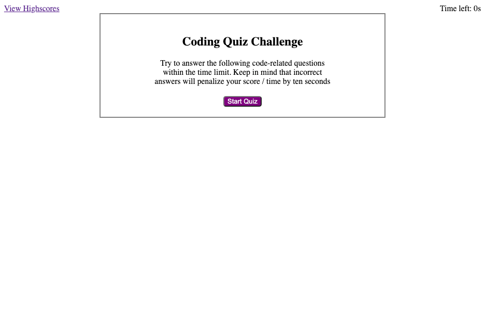
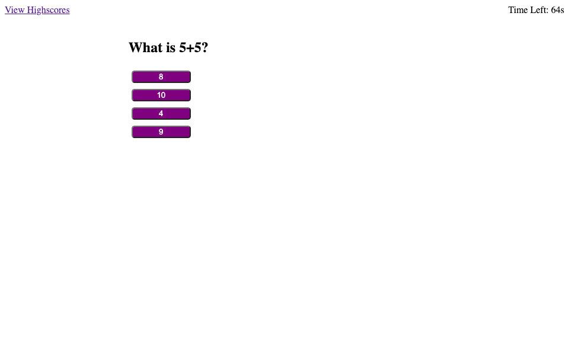
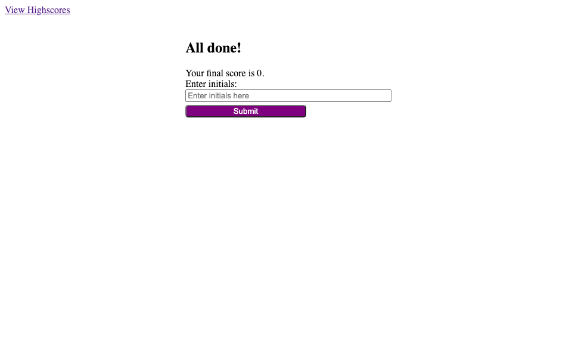
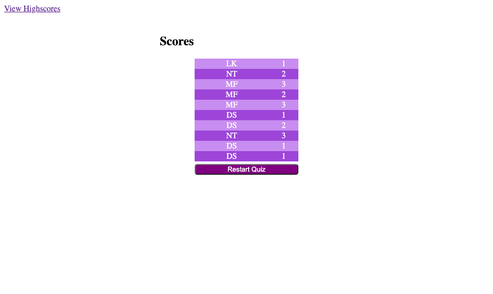

# JavaScript-Quiz

A quiz using Javascript Code

## Description

This web app is designed to create a timed quiz for the user to navigate through, and then store their quiz score and tie it to a user-inputted initial.

This was quite a difficult challenge for me. I found it quite difficult to make sense of what was going on with the HTML, as it was being dynamically added by JavaScript and was not easily readable for me. By the end of my assignment, I found it easier to understand the logic of using JavaScript to dynamically add HTML but I will need more practice to figure it out completely.

I was also able to better understand the difference between for..in and for..of loops, how while loops work, setting intervals, and a lot more about Javascript through this assignment.

Overall, I think there is a lot more I can learn but I am happy I was able to solve the issue at hand.

## Installation

Load index.html file to access landing page. CSS styling is external but linked within index.html page.

## Usage

The user is welcomed with a modest landing page.

There is a main element containing instructions on the quiz, and a "Start Quiz" button which will begin the quiz as soon as it is clicked.

At the top left, they can skip to see the scores for previous quizzes attempted.

At the top right, a timer is shown which will activate as soon as the button is clicked.

Once the user clicks the start quiz button, they will be presented with a series of questions (one at a time). The quiz will switch over to the next question upon the click of one of the answer options presented.

You will also notice that the timer has begun counting down. If an incorrect answer is clicked, the timer is bumped down a certain amount of time.

Once the user answers all questions or the timer runs out, they will be presented with an end page which presents their score and requests they input their initials

Once the user enters their initials and clicks the submit button, they are presented with their history of scores based on previous quiz attempts.

They can also click the restart quiz button to try again.

Page can alternatively be accessed [here](https://nadeemtalaat.github.io/JavaScript-Quiz/).

## Credits

- Nadeem Talaat

## License

[MIT](https://choosealicense.com/licenses/mit/)
